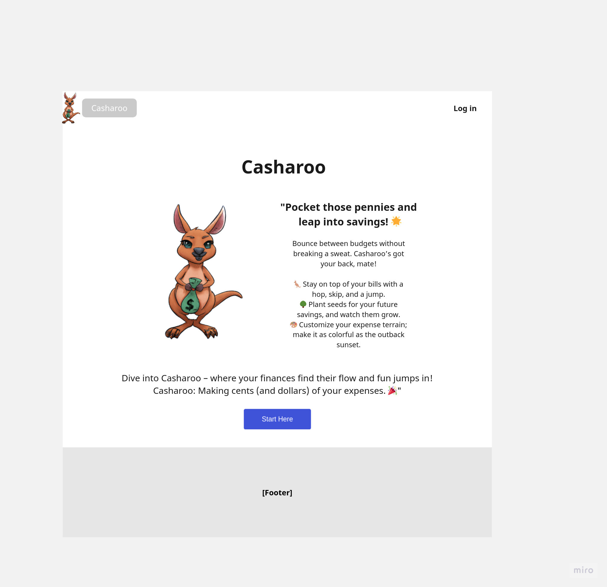
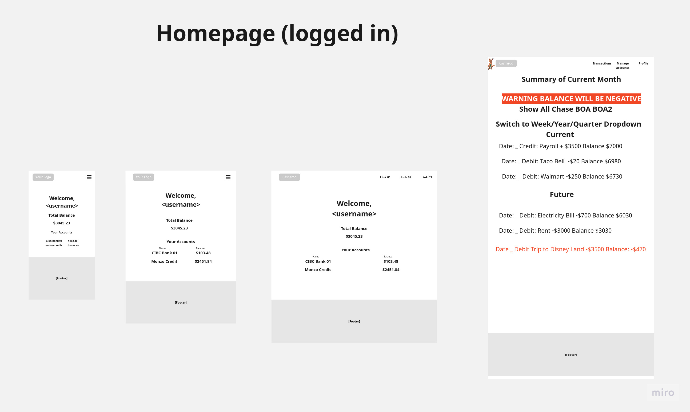
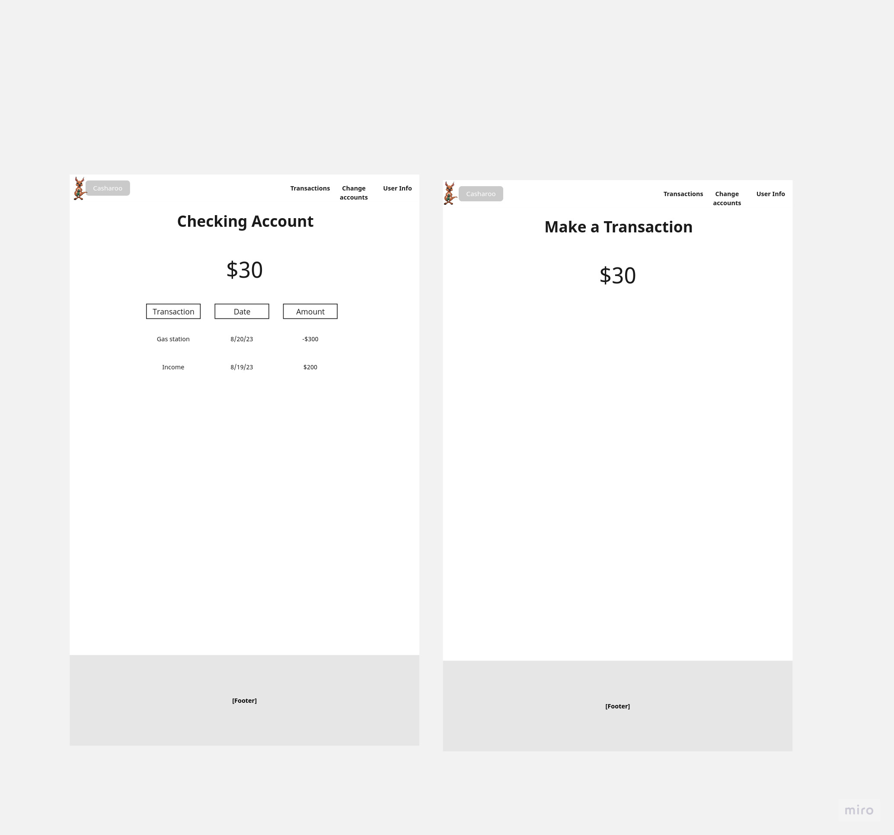
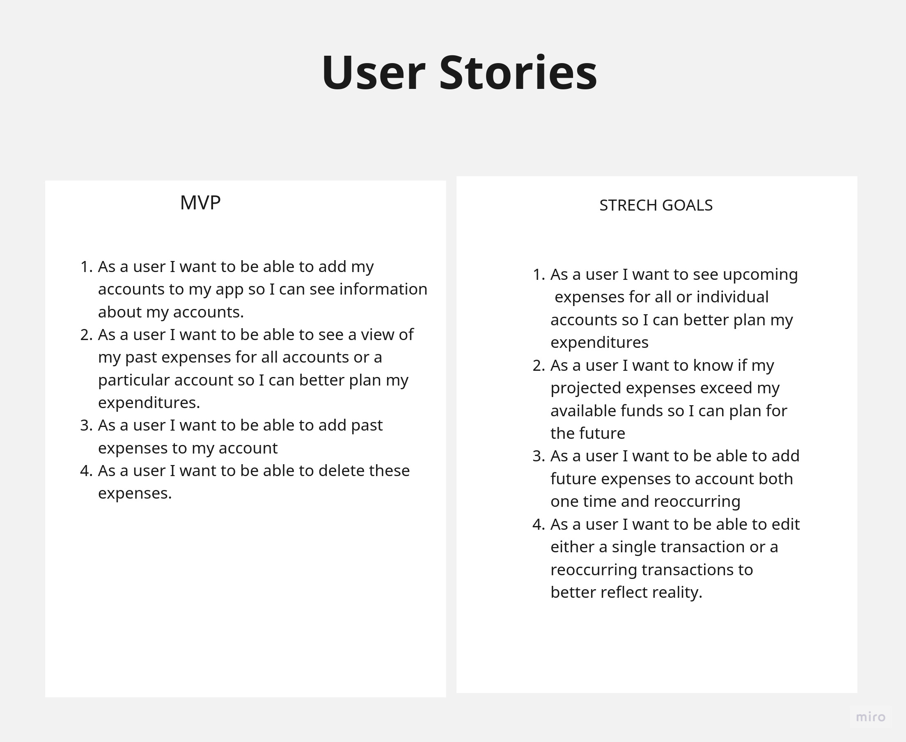
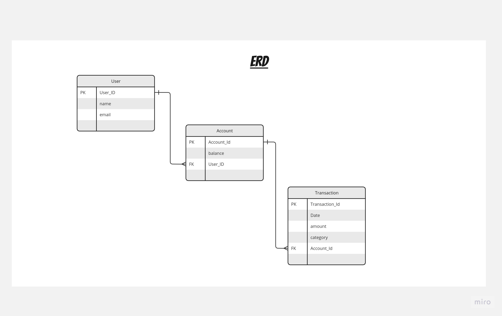
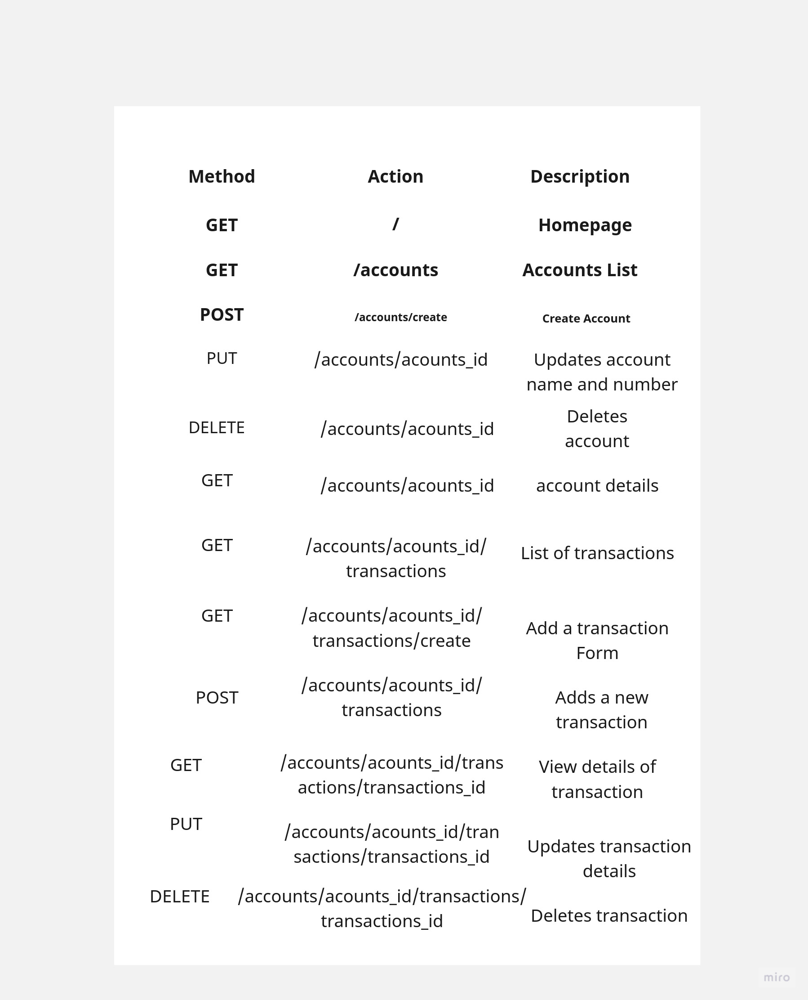

# Description
Casheroo is a user-friendly personal finance app that centralizes your financial data. By adding multiple accounts, users get a full view of their recent spending and total balance. The app tracks your current expenses and gives forecasts of your future spending. This keeps users well-informed and helps manage their money better.
# UI

## Logo

## Wireframes

### Before Login

### Logged in

### Account and Transaction View

# User Stories

# Implimentation

### ERD

### Routes

# Technology

* Django
* Postgres
* Tailwind

# MPV

## Views
* Account View
* Add/Edit Account View
* Add/Edit Transaction View
* Index view

## Features

* User can create and edit accounts
* User can create and edit transactions
* User can view an index view which can show one, multiple, or all accounts transactions and a running balance much like bank account view with controls as far as what accounts and duration to show. Each line will be clickable and show additional controls to edit/delete forms with controls for only one shown at once.

# Stretch Goals
## Features
* Show upcoming expenses
* Create recurring expenses
* Edit both Recurring and single transactions.
* Show a warning on top of index if account or all accounts transactions are projected to take balance which a user can click and scroll to the line where balance goes below zero.

# Icebox
## Views
* Calendar view
## Features
* Banking API
* Categorize Transactions
* Automatic categorization
* Budget help
